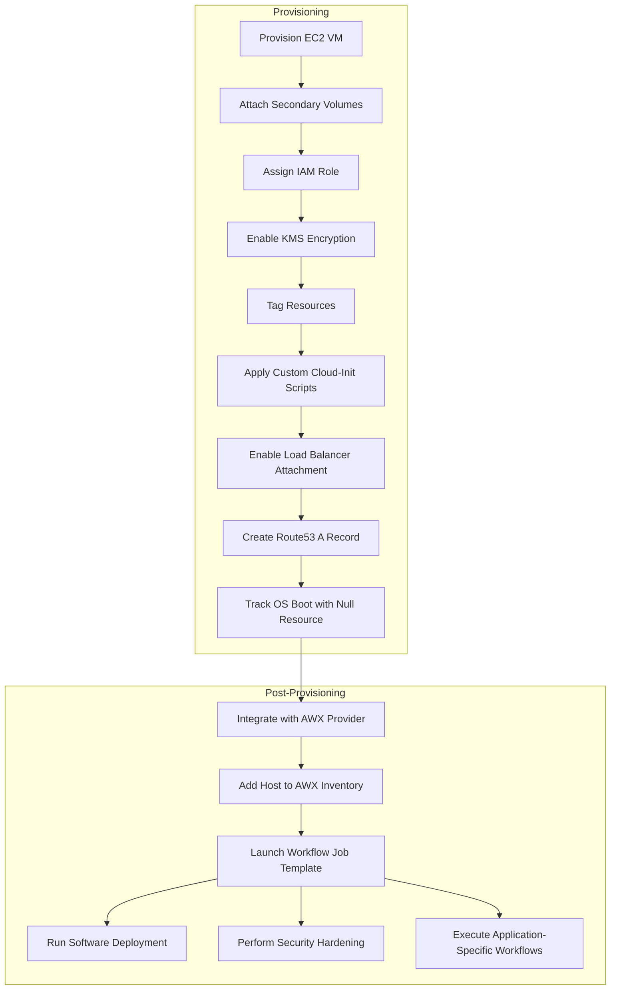

 
 # Terraform module: terraform-aws-ec2

   This Terraform module automates the provisioning and post-configuration of Amazon EC2 instances, incorporating essential features like volume management, DNS setup, tagging, cloud-init scripts, IAM roles, load balancer attachment, encryption, and post-provisioning automation using the AWX provider. 

---
## Functional Requirement and Assessment (Optional)

Add your process and methodology here- Example

- Requirement Gathering
- Feasibility Study
- Use Case Development
- Documentation

The document can be referred to [placeholder].

---
## Features and Capabilities

### 1. Provisioning
   - **Multi-OS Support**: Provision RHEL, SUSE, and Windows VMs.
   - **Custom Configurations**: Enable user-defined configurations for instance size, networking, and storage.
   - **Dynamic Volume Management**: Automatically create and attach secondary volumes, including IOPS-based volumes.
   - **Enhanced DNS Management**: Generate Route53 A Records for instance hostnames and aliases.
   - **Resource Tagging**: Apply mandatory tags and custom tags based on SAP or non-SAP configurations.
   - **Security Group Attachment**: Associate multiple security groups with each instance.
   - **Load Balancer Integration**: Optionally attach instances to an Application or Network Load Balancer during provisioning.
   - **KMS Encryption**: Enable EBS volume encryption using customer-managed keys.
   - **Snapshot Management**: Create final snapshots of attached volumes upon instance termination.

### 2. Post-Configuration
   - **Cloud-Init Automation**: Execute custom cloud-init scripts for RHEL, SUSE, and Windows.
   - **IAM Role Assignment**: Attach predefined IAM roles to instances for secure application access.
   - **AWX Automation**: Integrate with ansible AWX/AAP to perform post-provisioning actions like:
     - Software deployment and configuration.
     - Security hardening.
     - Application-specific workflows.


## Reference Diagram

Below is a simple flowchart showing the EC2 setup process:


## Terraform Module Structure
The Terraform module is organized into a root module and child modules. The root module orchestrates the creation of resources by calling these child modules, which can also be used independently to create specific resources.

### Root Module
The root module is the main entry point for the Terraform configuration. It calls the child modules to create the desired EC2 resources based on the provided configuration.

### Child Modules
The following child modules are included in this Terraform module:

**terraform-aws-ec2**

**Purpose:** Provision Amazon EC2 instances with features like volume management, DNS management, tagging, cloud-init scripts, IAM role assignment, load balancer attachment, encryption, and snapshot management.

**Usage:** This module can be used in the root module or independently, allowing customizable configurations for EC2 instances.

### Example (Root Module)

```hcl
//add locals for tags
locals {
  // locals for EC2 and EBS common tags
  ec2_ebs_common_tags = {
    Name            = "ec2-instance"
    environment     = "Dev"
    applicationname = "Terraform"
    account_id      = "123456789012"
    owner_email     = "rj@example.com"
  }

  ec2_specific_tags = {
    os-version = "RHEL 9.1"
    serverrole = "others"
  }

  // Final EC2 tags 
  ec2_tags = merge(local.ec2_ebs_common_tags, local.ec2_specific_tags)

  // Final EBS tags 
  ebs_tags = local.ec2_ebs_common_tags
}

module "aws_instance_example" {

  # Source and Dependencies
  source     = "./terraform-aws-ec2" # add private registry path if using terraform private Module registry
  #version    = "1.0.0"               #enable versioning if using terraform private Module registry
  depends_on = []

  # Global or Account Details
  account_id = "123456789012"
  region     = "eu-west-1"

  # Instance Details
  ami_owner               = "123456789012"
  hostname                = "example-instance"
  iam_role                = "AmazonEC2RoleforSSM"
  instance_type           = "t2.micro"
  operating_system        = "RHEL 9"
  user_data_runtime_creds = can(regex("(?i)windows", local.ec2_specific_tags["os-version"])) ? var.akv_local_user_aws_window_vm : var.akv_local_user_aws_linux_vm

  # Network Configuration
  security_groups = ["sg_app"]
  subnet_name     = "PrivateSubnet"
  vpc_name        = "VPC"

  # Volume Configuration
  kms_key_id         = "arn:aws:kms:eu-west-1:123456789012:key/example-key"
  root_vol_size      = 10
  root_vol_type      = "gp2"
  sec_vol_mount_name = ["/app1", "/app2", "/app3"]
  sec_vol_name       = ["xvde", "xvdf", "xvdg"]
  sec_vol_size       = [3, 4, 5]
  sec_vol_type       = ["gp3", "io1", "gp3"]
  sec_iops_value     = [null, 100, null]
  sec_vol_name_decom = [] # use only if you want to decommission the volume
  # Tags
  tags     = local.ec2_tags
  tags_ebs = local.ebs_tags

  # Load Balancer Configuration
  enable_loadbalancer_attachment = false
  
}

# Template Outputs
output "OUTPUT_example_IP" {
  value = module.aws_instance_example.private_ip
}

output "OUTPUT_example_ACCOUNT" {
  value = module.aws_instance_example.account_name
}
```
---
## Requirements

| Name | Version | Required On |
|------|---------|-------------|
| <a name="requirement_aws"></a> [aws access](#requirement_aws) | >= n/a | AWS Cloud |
| <a name="requirement_terraform"></a> [terraform cli](#requirement_terraform) | >= 1.9.0 | Terraform VM |
| <a name="requirement_aws_cli"></a> [aws cli](#requirement_aws_cli) | >= 2.0 | Terraform VM |
| <a name="requirement_powershell"></a> [powershell](#requirement_powershell) | >= 5.1 | Terraform VM |
| <a name="requirement_bash"></a> [bash](#requirement_bash) | >= 4.0 | Terraform VM |
| <a name="requirement_awx"></a> [awx](#requirement_awx) | >= 2.12.2 | Instances or Cluster |
| <a name="requirement_redhat_aap"></a> [redhat aap](#requirement_redhat_aap) | >= 2.0 | Instances or Cluster |

## Providers

| Name | Version |
|------|---------|
| <a name="provider_aws"></a> [aws](#provider_aws) | >= 5.65.0 |
| <a name="provider_null"></a> [null](#provider\_null) | n/a |
| <a name="provider_awx"></a> [awx](#provider_awx) |>= 0.29.1|

## Modules

No modules.

## Resources

| Name | Type |
|------|------|
| [aws_ebs_volume.ebs_volume](https://registry.terraform.io/providers/hashicorp/aws/latest/docs/resources/ebs_volume) | resource |
| [aws_instance.ec2_instance](https://registry.terraform.io/providers/hashicorp/aws/latest/docs/resources/instance) | resource |
| [aws_lb_target_group_attachment.attach_instance](https://registry.terraform.io/providers/hashicorp/aws/latest/docs/resources/lb_target_group_attachment) | resource |
| [aws_route53_record.record](https://registry.terraform.io/providers/hashicorp/aws/latest/docs/resources/route53_record) | resource |
| [aws_volume_attachment.volume_attachment](https://registry.terraform.io/providers/hashicorp/aws/latest/docs/resources/volume_attachment) | resource |
| [awx_host.add_host](https://registry.terraform.io/providers/denouche/awx/latest/docs/resources/host) | resource |
| [awx_workflow_job_template_launch.launch_workflow](https://registry.terraform.io/providers/denouche/awx/latest/docs/resources/workflow_job_template_launch) | resource |
| [null_resource.wait_for_instance_status](https://registry.terraform.io/providers/hashicorp/null/latest/docs/resources/resource) | resource |
| [aws_ami.ami](https://registry.terraform.io/providers/hashicorp/aws/latest/docs/data-sources/ami) | data source |
| [aws_iam_account_alias.account_name](https://registry.terraform.io/providers/hashicorp/aws/latest/docs/data-sources/iam_account_alias) | data source |
| [aws_kms_key.by_key_arn](https://registry.terraform.io/providers/hashicorp/aws/latest/docs/data-sources/kms_key) | data source |
| [aws_lb_target_group.tg](https://registry.terraform.io/providers/hashicorp/aws/latest/docs/data-sources/lb_target_group) | data source |
| [aws_route53_zone.selected](https://registry.terraform.io/providers/hashicorp/aws/latest/docs/data-sources/route53_zone) | data source |
| [aws_security_group.sg](https://registry.terraform.io/providers/hashicorp/aws/latest/docs/data-sources/security_group) | data source |
| [aws_subnet.subnet](https://registry.terraform.io/providers/hashicorp/aws/latest/docs/data-sources/subnet) | data source |
| [aws_vpc.vpc](https://registry.terraform.io/providers/hashicorp/aws/latest/docs/data-sources/vpc) | data source |
| [awx_inventory.selected_inventory](https://registry.terraform.io/providers/denouche/awx/latest/docs/data-sources/inventory) | data source |

## Inputs

| Name | Description | Type | Default | Required |
|------|-------------|------|---------|:--------:|
| <a name="input_account_id"></a> [account\_id](#input\_account\_id) | AWS Account ID to provision VM | `string` | `""` | no |
| <a name="input_ami_owner"></a> [ami\_owner](#input\_ami\_owner) | ID of AMI owner to use for the instance | `string` | `""` | no |
| <a name="input_ansible_dev_config"></a> [ansible\_dev\_config](#input\_ansible\_dev\_config) | Map of Ansible configuration values for the development environment | `map(string)` | <pre>{<br>  "ansible_aws_eu_inventory": "5",<br>  "ansible_hostname": "ansible-aap-dev.mycompany.com",<br>  "ansible_pat_token": "not-a-real-token",<br>  "rhel_dev_inventory_group_id": "25",<br>  "rhel_dev_wait_before_execution": "1m",<br>  "rhel_dev_workflow_job_template_id": "19",<br>  "rhel_dev_workflow_job_timeout_seconds": "1800",<br>  "rhel_prod_inventory_group_id": "21",<br>  "rhel_prod_wait_before_execution": "1m",<br>  "rhel_prod_workflow_job_template_id": "19",<br>  "rhel_prod_workflow_job_timeout_seconds": "1800",<br>  "rhel_test_inventory_group_id": "27",<br>  "rhel_test_wait_before_execution": "1m",<br>  "rhel_test_workflow_job_template_id": "19",<br>  "rhel_test_workflow_job_timeout_seconds": "1800",<br>  "windows_dev_inventory_group_id": "26",<br>  "windows_dev_wait_before_execution": "15m",<br>  "windows_dev_workflow_job_template_id": "23",<br>  "windows_dev_workflow_job_timeout_seconds": "1800",<br>  "windows_prod_inventory_group_id": "22",<br>  "windows_prod_wait_before_execution": "15m",<br>  "windows_prod_workflow_job_template_id": "23",<br>  "windows_prod_workflow_job_timeout_seconds": "1800",<br>  "windows_test_inventory_group_id": "28",<br>  "windows_test_wait_before_execution": "15m",<br>  "windows_test_workflow_job_template_id": "23",<br>  "windows_test_workflow_job_timeout_seconds": "1800"<br>}</pre> | no |
| <a name="input_ansible_prod_config"></a> [ansible\_prod\_config](#input\_ansible\_prod\_config) | Map of Ansible configuration values for the production environment | `map(string)` | <pre>{<br>  "ansible_aws_eu_inventory": "5",<br>  "ansible_hostname": "ansible-aap-prod.mycompany.com",<br>  "ansible_pat_token": "not-a-real-token",<br>  "rhel_dev_inventory_group_id": "25",<br>  "rhel_dev_wait_before_execution": "1m",<br>  "rhel_dev_workflow_job_template_id": "18",<br>  "rhel_dev_workflow_job_timeout_seconds": "1800",<br>  "rhel_prod_inventory_group_id": "21",<br>  "rhel_prod_wait_before_execution": "1m",<br>  "rhel_prod_workflow_job_template_id": "19",<br>  "rhel_prod_workflow_job_timeout_seconds": "1800",<br>  "rhel_test_inventory_group_id": "27",<br>  "rhel_test_wait_before_execution": "1m",<br>  "rhel_test_workflow_job_template_id": "19",<br>  "rhel_test_workflow_job_timeout_seconds": "1800",<br>  "windows_dev_inventory_group_id": "26",<br>  "windows_dev_wait_before_execution": "15m",<br>  "windows_dev_workflow_job_template_id": "23",<br>  "windows_dev_workflow_job_timeout_seconds": "1800",<br>  "windows_prod_inventory_group_id": "22",<br>  "windows_prod_wait_before_execution": "15m",<br>  "windows_prod_workflow_job_template_id": "23",<br>  "windows_prod_workflow_job_timeout_seconds": "1800",<br>  "windows_test_inventory_group_id": "28",<br>  "windows_test_wait_before_execution": "15m",<br>  "windows_test_workflow_job_template_id": "23",<br>  "windows_test_workflow_job_timeout_seconds": "1800"<br>}</pre> | no |
| <a name="input_enable_loadbalancer_attachment"></a> [enable\_loadbalancer\_attachment](#input\_enable\_loadbalancer\_attachment) | If true, the EC2 instance will be attached to the load balancer | `bool` | `false` | no |
| <a name="input_encryption"></a> [encryption](#input\_encryption) | If true, the EC2 instance Disk will be encrypted | `string` | `"true"` | no |
| <a name="input_final_snapshot"></a> [final\_snapshot](#input\_final\_snapshot) | If true, the EC2 instance will take a final snapshot | `string` | `"false"` | no |
| <a name="input_force_detach"></a> [force\_detach](#input\_force\_detach) | If true, the EC2 instance will force detach the volume | `string` | `"true"` | no |
| <a name="input_hostname"></a> [hostname](#input\_hostname) | Hostname of the VM | `string` | `""` | no |
| <a name="input_iam_role"></a> [iam\_role](#input\_iam\_role) | IAM Role to assign to the VM | `string` | `"AmazonEC2RoleforSSM"` | no |
| <a name="input_instance_type"></a> [instance\_type](#input\_instance\_type) | Type of instance to start | `string` | `""` | no |
| <a name="input_key_name_os"></a> [key\_name\_os](#input\_key\_name\_os) | Key Name to use for the instance | `string` | `""` | no |
| <a name="input_kms_key_id"></a> [kms\_key\_id](#input\_kms\_key\_id) | KMS Key to encrypt the instance disk | `string` | `""` | no |
| <a name="input_loadbalancer_target_group_name"></a> [loadbalancer\_target\_group\_name](#input\_loadbalancer\_target\_group\_name) | Name of the target group to attach the EC2 instance | `string` | `null` | no |
| <a name="input_loadbalancer_target_group_port"></a> [loadbalancer\_target\_group\_port](#input\_loadbalancer\_target\_group\_port) | Port of the target group to attach the EC2 instance | `number` | `null` | no |
| <a name="input_operating_system"></a> [operating\_system](#input\_operating\_system) | Operating System of VM | `string` | `""` | no |
| <a name="input_ppm_id"></a> [ppm\_id](#input\_ppm\_id) | Application PPM ID | `number` | `null` | no |
| <a name="input_region"></a> [region](#input\_region) | AWS Region to provision VM | `string` | `""` | no |
| <a name="input_root_vol_deletion"></a> [root\_vol\_deletion](#input\_root\_vol\_deletion) | If true, the EC2 instance Root Volume will delete on termination | `string` | `"true"` | no |
| <a name="input_root_vol_size"></a> [root\_vol\_size](#input\_root\_vol\_size) | Root Volume Size of Instance | `string` | `""` | no |
| <a name="input_root_vol_type"></a> [root\_vol\_type](#input\_root\_vol\_type) | Root Volume Type of Instance | `string` | `"gp2"` | no |
| <a name="input_sec_iops_value"></a> [sec\_iops\_value](#input\_sec\_iops\_value) | List of IOPS values for IOPS volumes | `list(number)` | `[]` | no |
| <a name="input_sec_vol_mount_name"></a> [sec\_vol\_mount\_name](#input\_sec\_vol\_mount\_name) | List of secondary volume mount names | `list(string)` | `[]` | no |
| <a name="input_sec_vol_name"></a> [sec\_vol\_name](#input\_sec\_vol\_name) | List of secondary volume names | `list(string)` | `[]` | no |
| <a name="input_sec_vol_name_decom"></a> [sec\_vol\_name\_decom](#input\_sec\_vol\_name\_decom) | List of secondary volume names to decommission | `list(string)` | `[]` | no |
| <a name="input_sec_vol_size"></a> [sec\_vol\_size](#input\_sec\_vol\_size) | List of secondary volume sizes | `list(number)` | `[]` | no |
| <a name="input_sec_vol_type"></a> [sec\_vol\_type](#input\_sec\_vol\_type) | List of secondary volume types | `list(string)` | `[]` | no |
| <a name="input_security_groups"></a> [security\_groups](#input\_security\_groups) | list of security groups to attach to the instance | `list(string)` | `[]` | no |
| <a name="input_subnet_name"></a> [subnet\_name](#input\_subnet\_name) | Subnet Name to provision VM | `string` | `""` | no |
| <a name="input_tags"></a> [tags](#input\_tags) | A mapping of tags to assign to all resources | `map(string)` | `{}` | no |
| <a name="input_tags_ebs"></a> [tags\_ebs](#input\_tags\_ebs) | A mapping of tags to assign to all resources | `map(string)` | `{}` | no |
| <a name="input_user_data_runtime_creds"></a> [user\_data\_runtime\_creds](#input\_user\_data\_runtime\_creds) | User Data Runtime Credentials | `string` | `""` | no |
| <a name="input_vpc_name"></a> [vpc\_name](#input\_vpc\_name) | VPC Name to provision VM | `string` | `""` | no |

## Outputs

| Name | Description |
|------|-------------|
| <a name="output_account_name"></a> [account\_name](#output\_account\_name) | AWS Account Alias |
| <a name="output_private_ip"></a> [private\_ip](#output\_private\_ip) | n/a |
| <a name="output_public_ip"></a> [public\_ip](#output\_public\_ip) | n/a |


## Build & Test

### Clone Terraform Module

```
git clone https://dev.azure.com/customer_orgInfraIAC/IT4IT_Ansible_Terraform_Core/_git/terraform-aws-ec2
```

### Move to the Terraform Directory

```
cd terraform-aws-ec2/example

edit the root module as per inputs
```

### Initializing the Environment

```
terraform init
```

### Planning the configuration

```
terraform plan
```

## Running the configuration
```
terraform apply
```